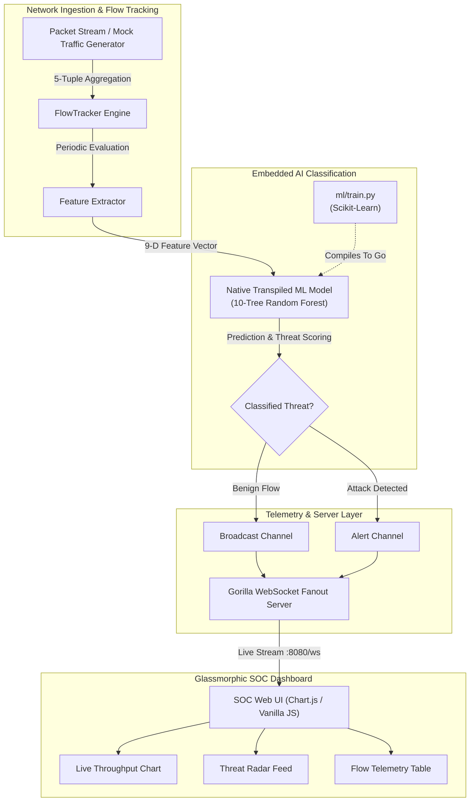

# 🛡️ NetSentinel AI

> **Real-Time AI-Powered Network Intrusion Detection System (NIDS) & SOC Telemetry Engine**

[](https://golang.org)
[](https://www.python.org)
[](https://scikit-learn.org)
[](https://github.com/gorilla/websocket)
[](LICENSE)

---

## 📌 Overview

**NetSentinel AI** is a lightweight, ultra-high-throughput Network Intrusion Detection System (NIDS) engineered in **Go** with an embedded **Machine Learning** decision engine and a glassmorphic real-time web dashboard.

Traditional NIDS platforms often face high latency or require heavy Python runtimes during packet inspection. NetSentinel AI bridges this gap through a novel **ML-to-Go transpilation pipeline**: Random Forest models trained in Python using Scikit-Learn are compiled directly into native Go decision-tree functions. This achieves **sub-microsecond classification latency** with zero CGo bindings, zero Python runtime overhead, and minimal memory footprint.

---

## 🏗️ Architecture



---

## ✨ Key Features

- **⚡ Sub-Microsecond ML Inference in Pure Go**:
  Decision trees trained with Scikit-Learn are compiled into pure Go branches (`pkg/classifier/model.go`). The model evaluates packets instantly with **zero external dependencies** or IPC overhead.
- **🔍 4-Class Threat Classification**:
  - `BENIGN`: Standard TCP/UDP traffic and web activity.
  - `DDOS`: High-frequency SYN flood and packet anomalies.
  - `PORTSCAN`: Rapid multi-port recon across well-known and dynamic ports.
  - `BRUTEFORCE`: Repeated authentication bursts targeting SSH (22) and FTP (21).
- **📊 Real-Time Glassmorphic SOC Operations UI**:
  A dark-mode cyberpunk operations dashboard featuring live throughput charts (Chart.js), animated alert badges, real-time metrics (Packets, Active Sessions, Anomalous Ratio), and detailed 5-tuple flow logs.
- **📡 Concurrent WebSocket Telemetry**:
  Built on Gorilla WebSocket with multi-client fanout, non-blocking channels, and automated flow expiration/garbage collection.
- **🚀 Instant Demo Mode (Built-In Generator)**:
  Includes a built-in mock network generator that produces normal HTTP/HTTPS traffic alongside intermittent DDoS, Port Scan, and Brute Force attacks—allowing full evaluation without root PCAP privileges.

---

## 📁 Repository Structure

```text
NetSentinel-AI/
├── .github/
│   └── workflows/
│       └── daily-commit.yml     # Automated workflow sync
├── ml/
│   └── train.py                 # Synthetic dataset generation & Go transpiler
├── pkg/
│   ├── classifier/
│   │   ├── classifier.go        # Class definitions & threat metadata
│   │   └── model.go             # Auto-generated native Go Random Forest
│   ├── server/
│   │   └── server.go            # HTTP static server & WebSocket fanout
│   └── sniffer/
│       └── sniffer.go           # 5-tuple flow tracker, cleaner loop & mock engine
├── web/
│   ├── index.html               # Glassmorphic SOC dashboard layout
│   └── app.js                   # WebSocket handler, Chart.js telemetry & UI logic
├── go.mod                       # Go module dependencies
├── go.sum                       # Go checksums
├── main.go                      # Application bootstrap & runtime coordinator
└── README.md                    # Project documentation
```

---

## 🧪 Feature Vector Layout

The classifier inspects 9 real-time flow dimensions calculated over sliding inspection intervals:

| Index | Feature | Description |
| :---: | :--- | :--- |
| `0` | **Duration** | Flow lifespan in seconds |
| `1` | **Protocol** | Transport layer (`1` = TCP, `2` = UDP, `3` = ICMP) |
| `2` | **Packet Count** | Total packets transferred within the flow |
| `3` | **Byte Count** | Total byte volume transmitted |
| `4` | **Source Port** | Ephemeral or originating port |
| `5` | **Destination Port** | Service port (e.g., `80`, `443`, `22`, `21`) |
| `6` | **SYN Flags** | Count of TCP SYN control flags |
| `7` | **ACK Flags** | Count of TCP ACK control flags |
| `8` | **FIN Flags** | Count of TCP FIN control flags |

---

## 🚀 Quickstart Guide

### Prerequisites

- **Go**: `1.22+` (tested on `1.24`)
- **Python**: `3.8+` (only required if retraining the ML model)
- Modern web browser (Chrome, Edge, Firefox)

---

### 1. Run NetSentinel AI

Clone and launch the application directly:

```bash
# Clone the repository
git clone https://github.com/konark-17/NetSentinel-AI.git
cd NetSentinel-AI

# Download dependencies
go mod download

# Run the system
go run main.go
```

The server will start and log:
```text
Initializing NetSentinel AI...
Mock packet generator activated successfully.
Serving UI assets from: ./web
NetSentinel dashboard server starting on http://localhost:8080
```

---

### 2. View the Live Dashboard

Open your web browser and navigate to:
```
http://localhost:8080
```

- Watch real-time packet throughput on the dynamic line chart.
- Observe incoming flow entries categorized as **BENIGN**, **DDOS**, **PORTSCAN**, or **BRUTEFORCE**.
- View automated security alerts populating the **Threat Radar Feed** as simulated attacks occur.

---

### 3. (Optional) Retrain the Machine Learning Model

To customize the detection thresholds or retrain the Random Forest model:

```bash
# Navigate to ML directory and install dependencies
cd ml
pip install numpy pandas scikit-learn

# Train model and transpile directly to pkg/classifier/model.go
python train.py
```

This updates `pkg/classifier/model.go` with newly generated decision trees. Simply restart `go run main.go` to deploy the updated weights.

---

## 🔮 Roadmap

- [ ] **Live NIC Capture**: Native libpcap / WinPcap / Npcap integration via `gopacket` for physical interface promiscuous mode.
- [ ] **eBPF Acceleration**: Kernel-space flow telemetry extraction for Linux environments.
- [ ] **Automated Active Defense**: Dynamic firewall rule generation (`iptables` / Windows Defender Firewall) to isolate malicious IPs automatically.
- [ ] **Expanded Threat Signatures**: Support for DNS tunneling, Slowloris, and ARP spoofing detection.

